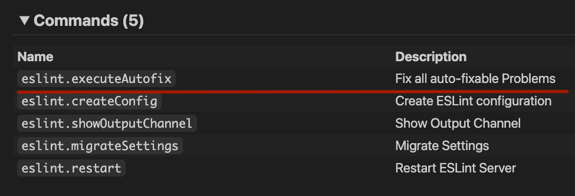

# VSCode Framework

> :fire: The fastest way to develop extensions for VSCode

💡 Not Boilerplated
⚡️ Hot Reload
🔑 Make Code Typed from `package.json`'s Contribution Points
📦 Optimized Build
🛠️ Configurable

## The Main Reason

I personally think that it's just tedious to maintain an average VSCode extension and there should be an easier way to do things. Also, I didn't like the boilerplated [generator-code](https://github.com/Microsoft/vscode-generator-code).

<!-- The standard `vscode` module just slows me down. -->

## Usage

Install it: `yarn add github:zardoy/vscode-tools#build` (I'll rename repo soon)

This framework encourage you to store the minimal amount of information in `package.json` (Extension Manifest).

Even in development workflow this extension

### Manifest Migration

Command: `vscode-framework migrate`

This is interactive command, so you can either just run it or read what it does below.

But note, these steps are optional.

- `package.json` cleanup: remove `engines`, `main`, `repository` and other fields that can be generated at start/build time.
- Removes `launch.json` and `tasks.json`
- Adds scripts to `package.json`:
  - `start`: `vscode-framework start` – just run this script to launch extension
  - `build`: `vscode-framework build` – create optimized build (doesn't create `.vsix` for a moment)
  - `postinstall` – Generate Types (not client for now) from Extension Manifest
- Creates config overrides

But this command for now doesn't perform migration for your code, if you have big codebase you can wait until this feature is done.

### Extension Code

```ts
//📁 src/extension.ts
import vscode from 'vscode';
import { VscodeFramework, showQuickPick } from 'vscode-framework';

export const activate = (ctx: vscode.ExtensionContext) => {
    const framework = new VscodeFramework(ctx);

    framework.registerCommand('make-project-awesome', async () => {
        const packageManager = showQuickPick([
            {
                label: 'Yarn (fast)',
                value: 'yarn'
            },
            {
                label: 'NPM (faster)',
                value: 'npm'
            },
            {
                label: 'PNPM (the fastest)',
                value: 'pnpm'
            }
        ]);
        // will be printed in output pane
        console.log('Selected', packageManager);
    });
}
```

### Config

You can create `vscode-framework.json` in the root to override [default config](src/config.ts).

### Development Workflow

I think you have noticed that it encourages to use start script instead of *launch config*. Which is significantly faster because no debugger warmup needed.
As a bonus this approach a IDE-agnostic and you can run extension even without opening IDE.

There is a hot reload feature, but you can manually restart editor with pressing <kdb>R</kbd> in console.

### The Big Tradeoff

Because we use ESBuild for blazing-fast compilation there is no type checking in console (but this is only temporary limitation).

For now you need to rely on your IDE.

#### About Description

Don't confuse `description` from commands above with description from VSCode's `Feature Contributes` tab:



#### About Keywords

Note, that VSCode doesn't support keywords for the commands, so

### Environment Variables

See [Environment Variables](build/client.d.ts) that are injected.

<!-- To get them in intellisense create `globals.d.ts` file in your source root with `///<reference lib="">` at the top. -->

And also, what about having IDE-agnostic API?
