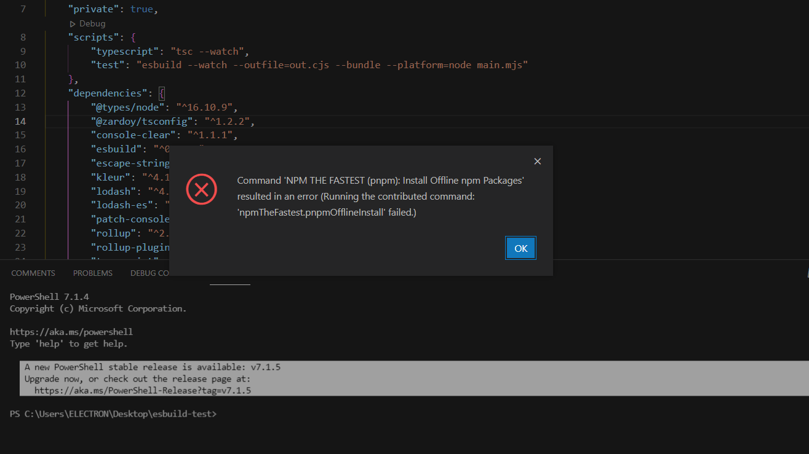
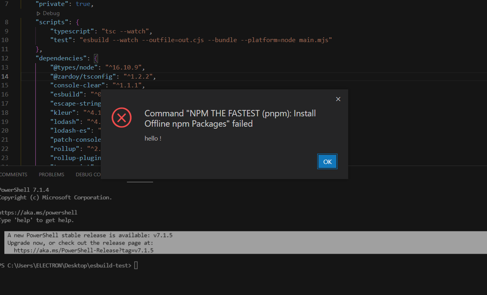

# Command Errors

Whenever you register command with `registerExtensionCommand` or `registerAllExtensionCommands`, you enable more options for handling errors. Let's start with default behavior.

These command handlers wraps with `try/catch` callback you pass, to display more graceful and helpful errors. Just compare:

Let's suppose you have `throw new Error('hello !')` somewhere in code of your command.

Default VSCode error reporting:



The same command, but registered with `registerExtensionCommand`:



## Graceful Errors

However, please don't throw regular `Error`s in your code, instead use `GracefulCommandError`, in this way we can tell to user, that extension works in expected way, but there is a problem on user-side.

```ts
import { GracefulCommandError, registerExtensionCommand } from 'vscode-framework'

const activate = () => {
    registerExtensionCommand('someCommand', () => {
        if (/* do some check here */) {
            throw new GracefulCommandError('npm is not installed, you can install it with Node.js', {
                actions: [
                    {
                        label: 'Download Node.js',
                        action() {
                            void vscode.env.openExternal(vscode.Uri.parse('https://nodejs.org/en/download/'))
                        },
                    },
                ],
            })
        }
    })
}
```
