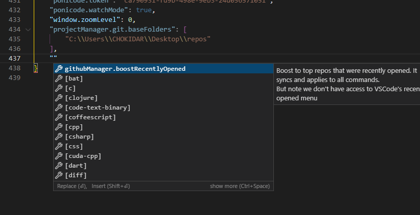

# Configuration

Basic documentation about configuration available at <https://code.visualstudio.com/api/references/contribution-points#contributes.configuration>. But let's extend it:

- never repeat yourself and put `title` into `configuration`, just leave as is
- normally you don't need to use (or even know about) `configurationDefaults`

## Linking to settings

Just use linking as you would normally use:

```json
{
    "enableSomeModule": {
        "type": "boolean",
        "default": false
    },
    "someModuleMode": {
        "type": "string",
        "markdownDescription": "Warning: this setting has an effect only when #enableSomeModule# is true.",
        "enum": ["modeA", "modeB"]
    }
}
```

You'll get warning if linked setting doesn't exist.

## Markdown in non-markdown Properties

To use markdown syntax, use need to prepend properties that support it with `markdown*`, e.g. `deprecationMessage` -> `markdownDeprecationMessage`.
If you don't do this, you'll receive warning, however you can set `config.contributions.markdownProperties` to `replace`, so vscode-framework will rename these properties for you.

## Top Level Defaults

| `type`    | Implies `default` |
| --------- | ----------------- |
| `array`   | `[]`              |
| `object`  | `{}`              |
| `string`  | `""`              |
| `number`  | `0`               |
| `integer` | `0`               |
| `boolean` | `false`           |
| `null`    | `null`            |

<!-- TODO aren't these defaults already documented somewhere? -->

## TypeScript Typing as Configuration

You must probably aware that JSON schema is used to define `configuration` (but with some additional fields), in simple cases you can continue to maintain the schema and typings will be generated for you. However, in case of large configurations you can save your time and use TypeScript type to maintain configuration instead.

### Switch to TypeScript

- **remove** `configuration` contribution from *package.json*
- create `src/configurationType.ts` with exported `Configuration` **type** (not interface!)
- use basic types as you always would:
  - primitives, arrays
  - objects: use `{[x: string]: ...}` and **not Record**

To specify JSON Schema-specific props, use [annotations](https://github.com/YousefED/typescript-json-schema#annotations)
You can also look at more examples and tests in [TJS Repository](https://github.com/YousefED/typescript-json-schema)

- include `@default` annotations for props and JSDoc description if needed

- your `generated.ts` will now point to this settings type (that's why it must be exported)

Properties of configuration schema must be plain e.g.:

```ts
export type Configuration = {
    "group.enableSomethingCool": {
        "type": "boolean"
    },
    "group.subGroup.limit": {
        "type": "number",
        "default": 50
    }
}
```

BUT NOT:

```ts
// IT WON'T WORK
export type Configuration = {
    group: {
        enableSomethingCool: {
            "type": "boolean"
        },
        subGroup: {
            limit: {
                "type": "number",
                "default": 50
            }
        }
    }
}
```

### Advantages

- Less to write (schemas in types are shorter)
- Use comments and TODOs right where your configuration lives
- Much shorter and readable (thus maintainable) configuration
- Reuse types (enums, or string unions in type)
- Use types libraries (such as `type-fest`)

### Known Limitations

- The generation process of schema might be slow. It can take up to 10 seconds to generate schema. However, framework to mitigate places cached generated version of schema it is gitignored by default, but you can commit it to speedup startup times for all developers. Framework in this case will regenerate schema only when necessary.
- no migrate command
- object-map support
- no support for annotations for special props (`markdown*`)
- no warnings on unsupported annotations
- no TypeScript plugin for annotations
- no `typeof defaultConfig` strategy available

## Other Useful Properties

Plus to properties that described in VSCode API's documentation, there are also top-level properties for `configuration` good to know:

<!-- TODO ensure all can be used in TS -->

### `defaultSnippets`

More at [VSCode docs](https://code.visualstudio.com/docs/languages/json#_define-snippets-in-json-schemas). You can also define it in `patternProperties` and `additionalProperties`.

### `errorMessage`

Message that will be printed along with problem message. (e.g. incorrect type)

### `doNotSuggest`

When set to `true` suggestion item with this setting id won't appear when editing `settings.json`, have no effect in settings UI.

### `suggestSortText`

Almost the same as `vscode.CompletionItem.sortTest`. Most probably you don't need it, but as an example, if you set it to `!`, your setting will appear on top.


